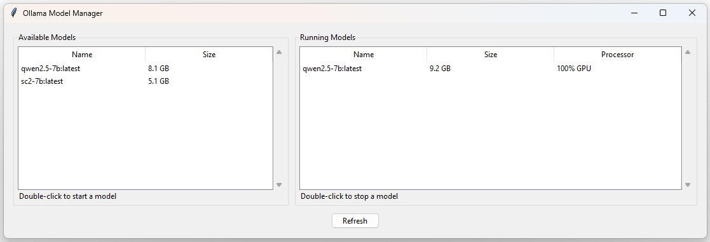

# Ollama Model Manager

A simple graphical user interface for managing Ollama models. This tool provides a user-friendly way to view, start, and stop Ollama models without using the command line.



## Features

- View all available Ollama models
- View currently running models
- Start models with double-click
- Stop running models with double-click
- Easy-to-use refresh functionality
- Confirmation dialogs for model operations

## Prerequisites

- Python 3.x
- Tkinter (usually comes with Python)
- [Ollama](https://ollama.ai/) installed and accessible from command line

## Installation

1. Clone this repository:
```bash
git clone https://github.com/MeNicefellow/ollama-gui
cd ollama-gui
```

2. Run the application:
```bash
python main.py
```

## Usage

1. The main window shows two panels:
   - Left panel: Available Models
   - Right panel: Running Models

2. To start a model:
   - Double-click on any model in the "Available Models" list
   - Confirm the action in the dialog

3. To stop a model:
   - Double-click on any model in the "Running Models" list
   - Confirm the action in the dialog

4. Click the "Refresh" button to update both lists

## Contributing

Contributions are welcome! Please feel free to submit a Pull Request.


## Acknowledgments

- [Ollama](https://ollama.ai/) for providing the base functionality
- Python Tkinter for the GUI framework


## Disclaimer

This software is provided "as is", without warranty of any kind, express or implied, including but not limited to the warranties of merchantability, fitness for a particular purpose and noninfringement. In no event shall the authors or copyright holders be liable for any claim, damages or other liability, whether in an action of contract, tort or otherwise, arising from, out of or in connection with the software or the use or other dealings in the software.

Users are responsible for checking and validating the correctness of their configuration files, safetensor files, and binary files generated using the software. The developers assume no responsibility for any errors, omissions, or other issues coming in these files, or any consequences resulting from the use of these files.


## License

[Apache 2.0](https://github.com/MeNicefellow/CosmoNicefellowTech/LICENSE)

## Discord Server

Join our Discord server [here](https://discord.gg/xhcBDEM3).

## Feeling Generous? ߘ

Eager to buy me a cup of 2$ coffe or iced tea?ߍ☕ Sure, here is the link: [https://ko-fi.com/drnicefellow](https://ko-fi.com/drnicefellow). Please add a note on which one you want me to drink?

